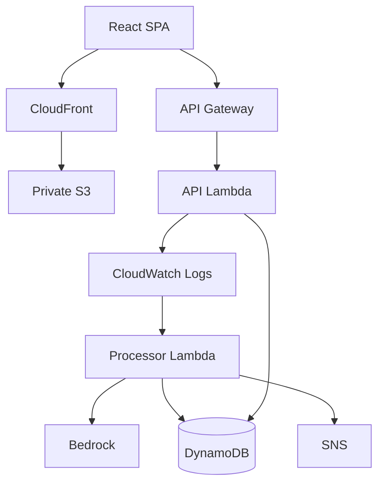

# IncidentLens AI

An AI-assisted incident detection and investigation platform that turns application
errors into structured incidents, enriches them using Amazon Bedrock, persists them,
notifies engineers, and exposes them through a React incident-management UI.

> Portfolio / demo AWS stack using production-style engineering practices.
> AI analysis is a **hypothesis** — engineers must verify before remediation.

## Problem

When applications fail, engineers often must manually correlate logs, identify the
failure mode, guess a likely cause, and notify responders. That early investigation
work is slow, repetitive, and easy to get wrong under pressure.

## Solution

IncidentLens automates the **initial** incident investigation loop:

1. Detect structured error candidates from application logs
2. Create a durable incident record
3. Ask Amazon Bedrock for a summary, possible cause, and recommended investigation steps
4. Notify on high/critical severity
5. Present the result in an operator UI with a simple lifecycle: open → investigating → resolved

Human judgment remains in the loop. The system assists investigation; it does not
remediate automatically.

## Architecture

Authoritative detail: [docs/architecture/overview.md](docs/architecture/overview.md).

### Backend / event path

```text
User / Application
    ↓
API Gateway
    ↓
Lambda API (Fastify)
    ↓
CloudWatch Logs
    ↓
CloudWatch Subscription Filter
    ↓
Processor Lambda
    ↓
Amazon Bedrock
    ↓
DynamoDB
    ↓
SNS notification (high/critical)
```

### Frontend path

```text
React (Vite SPA)
    ↓
private S3 (assets)
    ↓
CloudFront (HTTPS entry)
    ↓
API Gateway → Lambda API
```

Infrastructure is managed with **Terraform**. Deployments run through **GitHub Actions**
using **GitHub OIDC** (no long-lived AWS access keys in CI).



## End-to-End Incident Flow

1. Application generates an ERROR / 5XX (including a controlled demo failure path).
2. A structured `incident_candidate` event is written to CloudWatch Logs.
3. A subscription filter forwards the candidate to the processor Lambda.
4. The processor validates and maps the event.
5. An incident is created in DynamoDB (`saveIfAbsent` for idempotency).
6. Bedrock produces:
   - summary
   - possible cause
   - recommended investigation actions
7. The incident is updated with AI analysis (`completed` or `failed`).
8. SNS publishes a notification for high/critical severity.
9. The HTTP API exposes the incident (`GET /incidents`, `GET /incidents/:id`).
10. The React UI lists the incident and shows AI analysis on the detail page.
11. An engineer transitions status: **open → investigating → resolved**.

**Important:** AI output is advisory. Treat it as a starting hypothesis, not confirmed
root cause.

Proven on the deployed stack: [docs/verification/real-ai-incident-e2e.md](docs/verification/real-ai-incident-e2e.md).

## Technology Stack

| Area               | Technologies in this repo                                                                                         |
| ------------------ | ----------------------------------------------------------------------------------------------------------------- |
| **Frontend**       | React 19, TypeScript, Vite, React Router, Vitest, Testing Library                                                 |
| **Backend**        | Node.js 22, TypeScript, Fastify, Vitest                                                                           |
| **AWS**            | API Gateway HTTP API, Lambda, CloudWatch Logs + subscription filters, DynamoDB, SNS, S3, CloudFront, IAM, Bedrock |
| **AI**             | Amazon Bedrock (`IncidentAnalyzer` abstraction; Nova Lite in the deployed demo)                                   |
| **Infrastructure** | Terraform (modules + `environments/dev` + bootstrap OIDC/state)                                                   |
| **CI/CD**          | GitHub Actions, AWS IAM OIDC federated role                                                                       |
| **Observability**  | Structured JSON logging (Pino), request IDs, CloudWatch log groups + retention                                    |
| **Testing**        | Unit/integration (Vitest), Terraform native tests, deployment smoke/verify scripts                                |

## Key Engineering Features

- Serverless AWS architecture (API + event-driven processor)
- AI-assisted investigation with create-before-analyze reliability ordering
- Structured logging and request / incident ID correlation
- Incident lifecycle management (`open` / `investigating` / `resolved`)
- DynamoDB persistence with idempotent automatic creation
- SNS notifications for high/critical incidents
- CloudFront + private S3 SPA hosting (OAC)
- Terraform Infrastructure as Code
- GitHub Actions CI/CD with GitHub OIDC (no static AWS keys in CI)
- Least-privilege IAM for deploy and execution roles
- Automated unit/integration tests and deployment verification scripts
- Production-readiness review (security, observability, cost, resilience)

## Security

Implemented controls (demo/dev stack):

- GitHub Actions → AWS via **OIDC** (no static AWS keys in the workflow)
- Private frontend S3 bucket + **CloudFront OAC** (bucket not public)
- Explicit API Gateway **CORS** allowlist (no `*` origins)
- Scoped Lambda and deploy-role IAM (table/topic/model/bucket ARNs)
- Frontend receives only public config (`VITE_API_BASE_URL`)

Documented limitations (not production-hardened):

- HTTP API is **unauthenticated**
- Controlled `/test-error` endpoint is reachable on the deployed demo API
- No WAF / CloudFront access logs / enterprise auth

Full review: [docs/reviews/production-readiness-review.md](docs/reviews/production-readiness-review.md).

## Observability

- Structured JSON logs from the API and processor
- `requestId` on API requests (`x-request-id`) and `incidentId` in processing logs
- CloudWatch log groups for API Lambda, processor Lambda, and API Gateway access logs
- Retention configured in Terraform (default 30 days)

Known limitations: no CloudWatch alarms/dashboards yet; APIGW edge request IDs and
Fastify request IDs are not automatically unified end-to-end. See
[docs/runbooks/cloudwatch-logging.md](docs/runbooks/cloudwatch-logging.md).

## CI/CD

Workflow: [`.github/workflows/deploy-dev.yml`](.github/workflows/deploy-dev.yml)  
Runbook: [docs/runbooks/github-actions-deployment.md](docs/runbooks/github-actions-deployment.md)

| Event                     | Behavior                                                                                                                                                                                                                                                         |
| ------------------------- | ---------------------------------------------------------------------------------------------------------------------------------------------------------------------------------------------------------------------------------------------------------------- |
| **Pull request → `main`** | Application checks + Terraform fmt/validate/native tests. **No** AWS assume-role, **no** S3 sync, **no** CloudFront invalidation, **no** apply.                                                                                                                  |
| **Push → `main`**         | After CI: OIDC auth → Terraform plan → optional apply if `ENABLE_TERRAFORM_APPLY=true` → production frontend build (`VITE_API_BASE_URL` from Terraform outputs) → S3 sync → CloudFront invalidation → smoke/pipeline verification when apply/pipeline mode runs. |
| **`workflow_dispatch`**   | Plan-oriented; optional `pipeline_test_only` skips plan/apply/frontend deploy and runs live verification against the existing stack.                                                                                                                             |

Frontend asset deploy reads bucket/distribution/API URL from Terraform outputs and does
not use static AWS keys. Details: [docs/runbooks/frontend-deployment.md](docs/runbooks/frontend-deployment.md).

## Testing

| Layer                        | Command / artifact                           | Notes                                 |
| ---------------------------- | -------------------------------------------- | ------------------------------------- |
| Frontend unit/UI             | `npm run test:web`                           | Vitest + Testing Library              |
| Backend + domain + processor | `npm test`                                   | Vitest                                |
| Sprint 5 local AI pipeline   | `npm run test:sprint5-local`                 | Fakes for Bedrock/SNS; no AWS         |
| Typecheck                    | `npm run typecheck`, `npm run typecheck:web` |                                       |
| Lint                         | `npm run lint`                               |                                       |
| Terraform                    | `npm run test:terraform`, `fmt` / `validate` | Mocked provider tests locally         |
| Deployed smoke / E2E scripts | `scripts/verify-*.sh`                        | AWS; optional; can invoke Bedrock/SNS |

**Verified locally during SCRUM-55 / closeout validation (no live `/test-error` re-run):**

- Frontend tests: **104 passed**
- Sprint 5 local integration: **6 passed**
- Full `npm test` suite: **265 passed**
- Typechecks: **PASS**
- Terraform `fmt -check` / `validate`: **PASS**
- Terraform `plan` (SCRUM-55): **No changes**

Deployed end-to-end proof: [docs/verification/real-ai-incident-e2e.md](docs/verification/real-ai-incident-e2e.md) (SCRUM-54).

## Production Readiness

Summary of [SCRUM-55](docs/reviews/production-readiness-review.md):

| Category                 | Status                                                                                                                     |
| ------------------------ | -------------------------------------------------------------------------------------------------------------------------- |
| **Implemented controls** | OIDC CI, private SPA origin, scoped IAM, explicit CORS, structured logs, gated Terraform apply, deployment smoke scripts   |
| **Known risks**          | Unauthenticated API + `/test-error`, no alarms, Bedrock variable cost, CloudFront invalidation on main frontend deploys    |
| **Future hardening**     | AuthN/Z, gate/remove test endpoint, minimal alarms, tighter prod CORS, stronger request correlation, Bedrock cost controls |

This demo is **not** claimed to be enterprise production-ready.

## Cost Awareness

Serverless services were chosen so idle cost stays low for a portfolio demo while still
exercising real AWS primitives.

Major **variable** cost components:

- **Amazon Bedrock** (per enriched incident)
- CloudWatch Logs ingestion
- CloudFront invalidations on frontend deploy
- Lambda / API Gateway / DynamoDB at request volume (usually small at demo traffic)

When demos stop: prefer setting analyzer/notifier to non-billable modes and/or destroying
the **app** Terraform stack. Guidance:
[docs/reviews/production-readiness-review.md](docs/reviews/production-readiness-review.md)
and [infrastructure/terraform/README.md](infrastructure/terraform/README.md).

## Demo

Safe walkthrough of the **already deployed** UI (do **not** hammer `/test-error` in public demos):

1. Open the CloudFront frontend URL (`frontend_url` Terraform output).
2. Open **Incidents** and review the list (severity, status, Analysis column).
3. Open an incident marked **AI Analyzed**.
4. Inspect **Summary**, **Possible Cause**, and **Recommended Actions**.
5. Demonstrate status lifecycle controls (**Investigating** / **Resolved**) on an open incident.
6. Explain that high/critical incidents also publish to SNS (email delivery is a human inbox check after subscription confirmation).

## Project Structure

```text
apps/
  demo-api/              Fastify HTTP API (Lambda package)
  incident-processor/    CloudWatch → incident processor (Lambda package)
  web/                   React + Vite operator SPA
packages/                Shared domain / repository / analysis / notifications
infrastructure/terraform/
  bootstrap/             Remote state + GitHub OIDC deploy role
  environments/dev/      Deployed app stack
  modules/               Reusable Terraform modules
docs/
  architecture/          Architecture overview + subsystem docs
  runbooks/              Operational runbooks
  reviews/               Production-readiness review
  verification/          E2E verification evidence
  adr/                   Architecture Decision Records
scripts/                 Package, deploy, and verify helpers
.github/workflows/       Deploy Dev CI/CD
```

## Local Development

### Prerequisites

- **Node.js 22** (`engines`: `>=22 <23`; `.nvmrc` → `22`)
- **npm**

```bash
nvm install 22
nvm use
node -v   # expect v22.x
```

### Install

```bash
git clone https://github.com/gerardinhoo/incidentlens-ai.git
cd incidentlens-ai
nvm use
npm install
npm --prefix apps/web install
```

### Run API + UI

```bash
# Terminal 1 — API (default http://127.0.0.1:3000)
npm run dev

# Terminal 2 — frontend (http://localhost:5173, /api proxied to :3000)
npm run dev:web
```

Useful checks:

```bash
curl -i http://127.0.0.1:3000/health
npm run typecheck && npm run typecheck:web
npm test && npm run test:web
npm run lint
```

Environment notes:

- API config: `apps/demo-api/src/config/env.ts` (`PORT`, `LOG_LEVEL`, `INCIDENT_REPOSITORY`, DynamoDB vars)
- Frontend API base: `apps/web/.env.example` → `VITE_API_BASE_URL=/api` locally
- DynamoDB Local: [docs/runbooks/dynamodb-local.md](docs/runbooks/dynamodb-local.md)

`GET /test-error` is a **controlled** local/demo failure helper. Prefer not to call it
repeatedly against the shared deployed environment.

### Common npm scripts

| Script                                         | Purpose                          |
| ---------------------------------------------- | -------------------------------- |
| `npm run dev` / `dev:web`                      | Local API / frontend             |
| `npm run build` / `build:web` / `build:lambda` | Compile / Vite / Lambda packages |
| `npm test` / `test:web` / `test:sprint5-local` | Test suites                      |
| `npm run check`                                | typecheck + lint + test          |

## Deployment

Do not duplicate full deploy instructions here.

- App stack + modules: [infrastructure/terraform/README.md](infrastructure/terraform/README.md)
- Remote state / OIDC bootstrap: [docs/runbooks/terraform-remote-state.md](docs/runbooks/terraform-remote-state.md), [infrastructure/terraform/bootstrap/README.md](infrastructure/terraform/bootstrap/README.md)
- GitHub Actions: [docs/runbooks/github-actions-deployment.md](docs/runbooks/github-actions-deployment.md)
- Frontend deploy: [docs/runbooks/frontend-deployment.md](docs/runbooks/frontend-deployment.md)

Terraform apply/destroy should only be run intentionally by the project owner.

## Documentation

| Document                                                                                                 | Purpose                                                        |
| -------------------------------------------------------------------------------------------------------- | -------------------------------------------------------------- |
| [docs/architecture/overview.md](docs/architecture/overview.md)                                           | **Authoritative** architecture overview                        |
| [docs/architecture/ai-assisted-incident-pipeline.md](docs/architecture/ai-assisted-incident-pipeline.md) | AI pipeline sequence & failure isolation                       |
| [docs/architecture/frontend-aws-hosting.md](docs/architecture/frontend-aws-hosting.md)                   | CloudFront + private S3 hosting                                |
| [docs/adr/ADR-001-nodejs-typescript.md](docs/adr/ADR-001-nodejs-typescript.md)                           | Node/TypeScript ADR                                            |
| [docs/runbooks/](docs/runbooks/)                                                                         | Operational runbooks (logging, SNS, Bedrock, deploy, frontend) |
| [docs/verification/real-ai-incident-e2e.md](docs/verification/real-ai-incident-e2e.md)                   | SCRUM-54 deployed E2E evidence                                 |
| [docs/reviews/production-readiness-review.md](docs/reviews/production-readiness-review.md)               | SCRUM-55 security/obs/cost review                              |
| [docs/project-closeout.md](docs/project-closeout.md)                                                     | Portfolio scope closeout                                       |
| [docs/testing.md](docs/testing.md)                                                                       | Testing notes                                                  |
| [CONTRIBUTING.md](CONTRIBUTING.md)                                                                       | Story-driven workflow                                          |

## Future Improvements

From the SCRUM-55 review (not implemented as part of closeout):

- Authentication / authorization on the API and UI
- Protect or remove the controlled `/test-error` endpoint in shared environments
- Minimal CloudWatch alarms / dashboard
- Stronger end-to-end request correlation
- CloudFront access logging (when cost/threat model justifies it)
- Tighter production CORS (CloudFront-only)
- Bedrock cost controls / idle-mode defaults
- Optional DLQ / richer retry topology beyond current isolation model

## Project status

Planned portfolio scope is **complete**. See [docs/project-closeout.md](docs/project-closeout.md).

## Contributing

See [CONTRIBUTING.md](CONTRIBUTING.md) for the Jira/story-driven workflow and branch naming.
