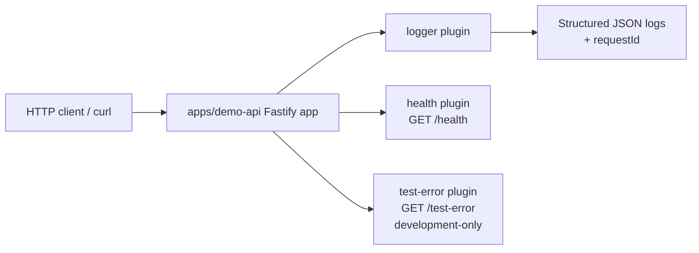

# IncidentLens AI

IncidentLens AI is a planned serverless, AI-assisted incident intelligence platform for software engineers and Site Reliability Engineers. The long-term goal is to help teams detect, understand, and respond to application failures faster.

**This repository is currently in Phase 1 — Foundation.** What exists today is a local Node.js + TypeScript Fastify demo API with structured logging, a health endpoint, a development-only failure endpoint, developer tooling, and automated tests. AWS, AI analysis, databases, authentication, and alerting are **not implemented yet**.

## Problem

Engineers often spend valuable time searching through logs before they can understand a production failure. That increases investigation time, operational effort, and Mean Time to Resolution (MTTR).

IncidentLens AI is intended to reduce that friction by turning failure signals and log context into structured incident analysis that engineers can review and act on. It will assist investigation; it will not replace human judgment or guarantee root-cause accuracy.

## Current status (Phase 1 — Foundation)

Implemented today:

- Monorepo-style repository layout for future apps and packages
- Node.js 22 + TypeScript project setup
- Fastify demo API (`apps/demo-api`)
- Plugin-based app structure (`logger`, `health`, `test-error`)
- Structured JSON logging with request IDs (Fastify + Pino)
- `GET /health` and development-only `GET /test-error`
- ESLint, Prettier, Husky, lint-staged, Vitest, and coverage support
- Foundation docs under `docs/`

Not implemented yet (planned for later phases):

- Incident processing engine
- AWS cloud integration (Lambda, API Gateway, CloudWatch, DynamoDB, SNS, and related services)
- Amazon Bedrock or other AI analysis
- Databases and durable incident storage
- Authentication and authorization
- Alerting / notification workflows
- React incident dashboard

## Prerequisites

- **Node.js 22** (project `engines` require `>=22 <23`; `.nvmrc` is set to `22`)
- **npm** (comes with Node.js)

If you use `nvm`:

```bash
nvm install 22
nvm use
node -v   # expect v22.x
```

Vitest 4 depends on tooling that requires a recent Node 22 release. If `npm test` fails with a `styleText` / `node:util` error, upgrade Node 22 and reinstall dependencies.

## Installation

```bash
git clone https://github.com/gerardinhoo/incidentlens-ai.git
cd incidentlens-ai
nvm use
npm install
```

## Local startup

Development (TypeScript via `tsx`, auto-reload):

```bash
npm run dev
```

Production-style local run (compile, then start compiled JS):

```bash
npm run build
npm start
```

By default the API listens on `http://127.0.0.1:3000` (`HOST=0.0.0.0`, `PORT=3000`).

Quick checks:

```bash
curl -i http://127.0.0.1:3000/health
curl -i http://127.0.0.1:3000/test-error
```

## Environment variables

Configured in `apps/demo-api/src/config/env.ts`.

| Variable                   | Required | Default     | Description                                                                                                      |
| -------------------------- | -------- | ----------- | ---------------------------------------------------------------------------------------------------------------- |
| `PORT`                     | No       | `3000`      | HTTP port for `npm run dev` / `npm start`                                                                        |
| `HOST`                     | No       | `0.0.0.0`   | Listen address                                                                                                   |
| `LOG_LEVEL`                | No       | `info`      | Pino level: `fatal`, `error`, `warn`, `info`, `debug`, `trace`, or `silent`. Invalid values fall back to `info`. |
| `INCIDENT_REPOSITORY`      | No       | `memory`    | Persistence backend: `memory` or `dynamodb`                                                                      |
| `AWS_REGION`               | No       | `us-east-1` | AWS region used when `INCIDENT_REPOSITORY=dynamodb`                                                              |
| `DYNAMODB_INCIDENTS_TABLE` | Cond.    | —           | Required when `INCIDENT_REPOSITORY=dynamodb`                                                                     |
| `DYNAMODB_ENDPOINT`        | No       | —           | Optional custom endpoint (for DynamoDB Local)                                                                    |

There is no `.env` loader in the app today. Export variables in your shell, or prefix commands:

```bash
PORT=3001 LOG_LEVEL=debug npm run dev
```

Service identity values (`serviceName`, `serviceVersion`) are constants in code, not environment variables.

For DynamoDB Local setup, see [docs/runbooks/dynamodb-local.md](docs/runbooks/dynamodb-local.md).

## npm scripts

| Script                        | Purpose                                      |
| ----------------------------- | -------------------------------------------- |
| `npm run dev`                 | Start the demo API with `tsx watch`          |
| `npm run build`               | Compile TypeScript with `tsc` into `dist/`   |
| `npm start`                   | Run the compiled server from `dist/`         |
| `npm run typecheck`           | Typecheck without emitting files             |
| `npm run lint`                | Run ESLint                                   |
| `npm run lint:fix`            | Run ESLint with `--fix`                      |
| `npm run format`              | Format the repo with Prettier                |
| `npm run format:check`        | Check formatting without writing             |
| `npm test`                    | Run Vitest once                              |
| `npm run test:watch`          | Run Vitest in watch mode                     |
| `npm run test:coverage`       | Run Vitest with V8 coverage                  |
| `npm run test:terraform`      | Terraform native tests (mocked AWS)          |
| `npm run test:lambda-package` | Validate `dist/lambda` package               |
| `npm run test:smoke`          | Deployed HTTPS smoke tests (`API_URL=...`)   |
| `npm run check`               | `typecheck` + `lint` + `test`                |
| `npm run clean`               | Remove `dist/`                               |
| `npm run prepare`             | Husky git-hook setup (runs on `npm install`) |

## CI/CD testing

Workflow: [`.github/workflows/deploy-dev.yml`](.github/workflows/deploy-dev.yml) (Deploy Dev).

```bash
npm test
npm run test:coverage
npm run test:terraform
npm run build:lambda && npm run test:lambda-package
API_URL="https://YOUR_API.execute-api.us-east-1.amazonaws.com" npm run test:smoke
```

Details: [docs/runbooks/deployment-testing.md](docs/runbooks/deployment-testing.md).

## HTTP endpoints

### `GET /health`

Liveness/info endpoint for the demo API.

Example:

```bash
curl -i http://127.0.0.1:3000/health
```

Example response (`200`):

```json
{
  "status": "ok",
  "service": "incidentlens-demo-api",
  "version": "1.0.0",
  "timestamp": "2026-07-25T16:01:01.954Z",
  "uptime": 0.330174609
}
```

Also returns an `x-request-id` response header.

### `GET /test-error` (development-only)

Controlled failure endpoint used to exercise structured error logging and observability locally.

**Development-only intent:** use this for local testing and demo purposes. It always returns HTTP 500 by design. It is not an incident feature and should not be treated as production product behavior. The route is currently registered by the demo API app factory whenever the server starts.

Example:

```bash
curl -i -H 'x-request-id: local-test-1' http://127.0.0.1:3000/test-error
```

Example response (`500`):

```json
{
  "statusCode": 500,
  "error": "Internal Server Error",
  "message": "Controlled test failure",
  "requestId": "local-test-1"
}
```

The JSON body does not include a stack trace. The server also writes a structured error log line that includes the same request ID.

### `GET /incidents`

List all incidents from the configured repository.

Example:

```bash
curl -i http://127.0.0.1:3000/incidents
```

Example response (`200`) — a JSON array of Incident objects, newest `createdAt` first:

```json
[
  {
    "id": "bbbbbbbb-bbbb-4bbb-8bbb-bbbbbbbbbbbb",
    "title": "Newer incident",
    "source": "demo-api",
    "severity": "high",
    "status": "open",
    "errorType": "TimeoutError",
    "metadata": {},
    "createdAt": "2026-01-02T10:00:00.000Z",
    "updatedAt": "2026-01-02T10:00:00.000Z"
  },
  {
    "id": "aaaaaaaa-aaaa-4aaa-8aaa-aaaaaaaaaaaa",
    "title": "Older incident",
    "source": "demo-api",
    "severity": "low",
    "status": "open",
    "errorType": "Error",
    "metadata": {},
    "createdAt": "2026-01-01T10:00:00.000Z",
    "updatedAt": "2026-01-01T10:00:00.000Z"
  }
]
```

When no incidents exist, the response is still `200` with an empty array:

```json
[]
```

**Current limitation:** no pagination, filtering, or search. The full list is returned.

### `GET /incidents/:id`

Retrieve a single incident by id from the configured repository.

Example:

```bash
curl -i http://127.0.0.1:3000/incidents/c653578c-0df7-4e20-bf72-5aa2d1b62400
```

Example response (`200`) when found — the complete Incident entity:

```json
{
  "id": "c653578c-0df7-4e20-bf72-5aa2d1b62400",
  "title": "API down",
  "source": "demo-api",
  "severity": "high",
  "status": "open",
  "errorType": "TimeoutError",
  "metadata": {},
  "createdAt": "2026-07-29T20:00:00.000Z",
  "updatedAt": "2026-07-29T20:00:00.000Z"
}
```

Example response (`404`) when missing:

```json
{
  "status": "error",
  "message": "Incident not found"
}
```

### `PATCH /incidents/:id/status`

Update an incident's lifecycle status.

Request body:

```json
{
  "status": "investigating"
}
```

`status` must be one of: `open`, `investigating`, `resolved`.

Allowed transitions:

- `open` → `investigating`
- `open` → `resolved`
- `investigating` → `resolved`

Same-state and reverse transitions are rejected.

Example:

```bash
curl -i -X PATCH http://127.0.0.1:3000/incidents/c653578c-0df7-4e20-bf72-5aa2d1b62400/status \
  -H 'content-type: application/json' \
  -d '{"status":"investigating"}'
```

| Status | When                                                                            |
| ------ | ------------------------------------------------------------------------------- |
| `200`  | Transition applied; response is the full updated Incident (`updatedAt` changes) |
| `400`  | Invalid body (missing/unsupported `status`, unknown fields)                     |
| `404`  | Incident id not found                                                           |
| `409`  | Valid status value, but transition is not allowed                               |

Example `409` response:

```json
{
  "status": "error",
  "message": "Invalid incident status transition"
}
```

## Structured logging and request IDs

The demo API uses Fastify’s built-in Pino logger.

- Logs are structured JSON on stdout.
- Base fields include `service` and `version`.
- Level is controlled with `LOG_LEVEL`.
- Each request gets a request ID:
  - taken from incoming `x-request-id` when present, otherwise generated
  - logged as `requestId`
  - echoed back on responses as the `x-request-id` header
- Request/response lines are emitted by Fastify/Pino; `/test-error` also logs an explicit error event.

This supports correlating a client request with server logs during local investigation.

## Current architecture



App composition lives in `apps/demo-api/src/app.ts`:

1. Create Fastify with logger + request-ID options
2. Register `logger` plugin
3. Register `health` plugin
4. Register `test-error` plugin

`server.ts` only starts and stops the process (`listen`, signal shutdown). Tests call `buildApp()` and use `app.inject()` without opening a network port.

## Repository structure

```text
apps/demo-api/        Fastify demo API (Phase 1 implementation)
packages/             Placeholder for shared packages
infrastructure/       Placeholder for future IaC
docs/                 Architecture notes, ADRs, testing docs, runbooks, SRE notes
scripts/              Placeholder for operational scripts
tests/                Placeholder for cross-app tests
.github/              GitHub templates/workflows placeholders
```

Important demo API paths:

```text
apps/demo-api/src/app.ts              App factory / plugin registration
apps/demo-api/src/server.ts           Process entrypoint
apps/demo-api/src/config/env.ts       Environment configuration
apps/demo-api/src/plugins/logger.ts   Logging + request ID behavior
apps/demo-api/src/plugins/health.ts   GET /health
apps/demo-api/src/plugins/test-error.ts  GET /test-error
apps/demo-api/src/app.test.ts         Vitest suite
```

## Testing and coverage

Details: [docs/testing.md](docs/testing.md)

```bash
npm test
npm run test:watch
npm run test:coverage
npm run check
```

The demo API suite covers:

- `GET /health` → `200` and payload shape
- `GET /test-error` → `500`, safe body, structured error log
- unknown route → `404`

Coverage HTML output is written to `coverage/` (gitignored).

## Current limitations

- Single local demo API only; no cloud deployment
- No authentication, authorization, or multi-tenant isolation
- No database or persistent incident store
- No AI/log-analysis pipeline
- No alerting or notification integrations
- `/test-error` is always available in the running demo API (not environment-gated yet)
- Shared packages, infrastructure, and CI workflows are mostly placeholders

## Planned next steps

Aligned with the project phases:

1. Continue hardening the foundation as needed
2. Build the incident processing engine
3. Add AWS cloud integration
4. Build the React incident dashboard
5. Expand DevOps, observability, and SRE practices

## Contributing

See [CONTRIBUTING.md](CONTRIBUTING.md) for the story-driven workflow and branch naming conventions.
