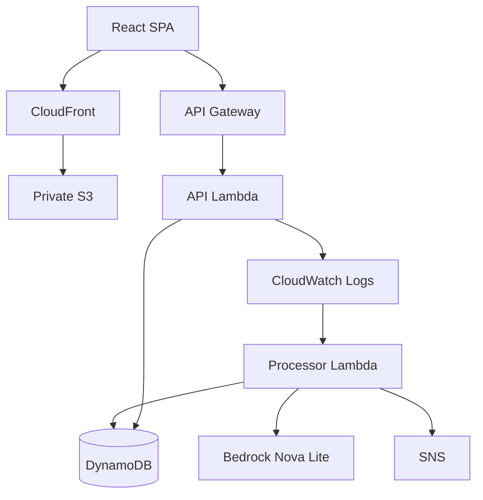

# IncidentLens AI

An AI-assisted incident detection and investigation platform that turns
application failures into structured incidents, enriches them with Amazon
Bedrock, persists them in DynamoDB, notifies engineers via SNS, and exposes
them through a React operator UI.

AI analysis produces **summaries, possible causes, and recommended investigation
actions**. It is a hypothesis for engineers—not confirmed root cause and not
autonomous remediation.

## Screenshots

Add images under `docs/screenshots/` (gitignored until you add real files), then
uncomment the markdown below.

<!--


-->

| Screenshot                                | Suggested capture                                                |
| ----------------------------------------- | ---------------------------------------------------------------- |
| `docs/screenshots/incident-list.png`      | Incidents list with severity, status, and Analysis column        |
| `docs/screenshots/incident-detail-ai.png` | Detail page showing Summary, Possible Cause, Recommended Actions |
| `docs/screenshots/status-workflow.png`    | Status controls (open → investigating → resolved)                |

## Problem

When applications fail, engineers often spend early investigation time
correlating logs, inferring likely causes, and notifying responders. That work
is repetitive and easy to get wrong under pressure.

## Solution

IncidentLens automates the **initial** investigation loop:

1. Detect structured **`incident_candidate`** events from application logs
2. Create a durable incident record (idempotent)
3. Ask Amazon Bedrock for a summary, possible cause, and recommended investigation actions
4. Notify on **high/critical** severity via SNS
5. Present results in a React UI with lifecycle: open → investigating → resolved

**Detection note:** automation matches structured JSON logs with
`eventType = "incident_candidate"`. It does **not** scrape every ERROR/CRITICAL
line from CloudWatch.

## Architecture

Authoritative detail: [docs/architecture/overview.md](docs/architecture/overview.md).

### Event-driven incident path

```text
Application / API (structured incident_candidate log)
    ↓
CloudWatch Logs
    ↓
Subscription filter  { $.eventType = "incident_candidate" }
    ↓
Processor Lambda
    ↓
DynamoDB persistence first (saveIfAbsent)
    ↓
Amazon Bedrock (Nova Lite) — allow-listed operational fields
    ↓
DynamoDB analysis update
    ↓
SNS notification (high/critical only)
```

There is **no SQS** in this architecture. CloudWatch Logs invokes the processor
Lambda directly.

### Frontend path

```text
Browser
    ↓
CloudFront (HTTPS)
    ↓
private S3 (OAC) — static SPA assets

Browser
    ↓
API Gateway → API Lambda (Fastify) → DynamoDB
```

Infrastructure is **Terraform**. Deployments use **GitHub Actions** with
**GitHub OIDC** (no long-lived AWS access keys in CI).



## End-to-End Incident Flow

1. An application path emits a structured `incident_candidate` log (local demos may use the optional controlled `GET /test-error` when explicitly enabled).
2. CloudWatch retains the log; the subscription filter matches `incident_candidate`.
3. The processor Lambda validates and maps the candidate.
4. An incident is created in DynamoDB (`saveIfAbsent` for idempotency).
5. Bedrock returns summary, possibleCause, and recommendedActions (investigation steps).
6. The incident is updated with AI analysis (`completed` or `failed`).
7. SNS publishes for high/critical severity.
8. The API exposes `GET /incidents` and `GET /incidents/:id`.
9. The React UI lists the incident and shows AI analysis.
10. An engineer transitions status: **open → investigating → resolved**.

Duplicates (same CloudWatch source event id) skip re-analysis and re-notification.
Bedrock or SNS failure does not delete a persisted incident.

## Technology Stack

| Area               | Technologies                                                                                             |
| ------------------ | -------------------------------------------------------------------------------------------------------- |
| **Frontend**       | React 19, TypeScript, Vite, React Router, Vitest                                                         |
| **Backend**        | Node.js 22, TypeScript, Fastify, Vitest                                                                  |
| **AWS**            | API Gateway, Lambda, CloudWatch Logs + subscription filters, DynamoDB, SNS, S3, CloudFront, IAM, Bedrock |
| **AI**             | Amazon Bedrock Converse (`amazon.nova-lite-v1:0` in the deployed stack)                                  |
| **Infrastructure** | Terraform (modules, `environments/dev`, OIDC bootstrap)                                                  |
| **CI/CD**          | GitHub Actions + AWS IAM OIDC                                                                            |
| **Observability**  | Structured JSON logs (Pino), request IDs, CloudWatch log retention                                       |

## Key Engineering Features

- Serverless, event-driven processing (CloudWatch → Lambda; no SQS)
- Create-before-analyze reliability ordering
- Idempotent automatic incident creation
- Allow-listed Bedrock inputs + validated structured outputs
- SNS notifications for high/critical
- CloudFront + private S3 SPA hosting (OAC)
- Terraform IaC and GitHub OIDC CI/CD
- Least-privilege-oriented IAM
- Automated unit/integration tests and deployment verification scripts

## Security

- GitHub Actions → AWS via **OIDC** (no static AWS keys in the workflow)
- Private frontend S3 + CloudFront OAC
- Explicit API Gateway CORS (no `*` origins)
- Scoped Lambda / deploy-role IAM
- `GET /test-error` **disabled by default** (`ENABLE_TEST_ERROR_ENDPOINT`)
- Bedrock receives minimized operational fields only

Known limitations of this reference stack: HTTP API is unauthenticated; no WAF /
CloudFront access logs. See [SECURITY.md](SECURITY.md) and
[docs/reviews/production-readiness-review.md](docs/reviews/production-readiness-review.md).

## Observability

Structured JSON logs with `requestId` / `incidentId`, CloudWatch log groups for
API, processor, and API Gateway access logs (retention via Terraform). Alarms and
dashboards are not implemented yet.
[docs/runbooks/cloudwatch-logging.md](docs/runbooks/cloudwatch-logging.md).

## CI/CD

Workflow: [`.github/workflows/deploy-dev.yml`](.github/workflows/deploy-dev.yml)

| Event             | Behavior                                                                                                                                                                                       |
| ----------------- | ---------------------------------------------------------------------------------------------------------------------------------------------------------------------------------------------- |
| **PR → `main`**   | Lint/typecheck/tests/build + Terraform validate. No AWS mutation.                                                                                                                              |
| **Push → `main`** | OIDC → Terraform plan → optional apply (`ENABLE_TERRAFORM_APPLY`) → frontend build with `VITE_API_BASE_URL` → S3 sync → CloudFront invalidation → smoke/pipeline verification when applicable. |

## Testing

| Layer                        | Command                                                      |
| ---------------------------- | ------------------------------------------------------------ |
| Frontend                     | `npm run test:web`                                           |
| Backend / processor / domain | `npm test`                                                   |
| Local AI pipeline (fakes)    | `npm run test:sprint5-local`                                 |
| Typecheck / lint             | `npm run typecheck`, `npm run typecheck:web`, `npm run lint` |
| Terraform tests              | `npm run test:terraform`                                     |

Representative local results from project closeout validation: frontend **104**,
Sprint 5 local **6**, full `npm test` **265**, typechecks **PASS**. Deployed
end-to-end evidence: [docs/verification/real-ai-incident-e2e.md](docs/verification/real-ai-incident-e2e.md).

## Production readiness & cost

Implemented: OIDC CI, private SPA origin, scoped IAM, explicit CORS, structured
logs, gated Terraform apply. Residual risks: unauthenticated API, no alarms,
Bedrock variable cost when enrichment runs. Serverless keeps idle cost low;
Bedrock is the main variable driver. See the production-readiness review.

## Demo

Preferred walkthrough of an **already populated** UI (do not repeatedly trigger
pipeline generation against a shared stack):

1. Open the CloudFront frontend (`frontend_url` Terraform output).
2. Review the incidents list (severity, status, Analysis).
3. Open an **AI Analyzed** incident and inspect Summary / Possible Cause / Recommended Actions.
4. Demonstrate status transitions.
5. Explain SNS for high/critical (email confirmation is a human inbox step).

Controlled `GET /test-error` is for intentional demos only and requires
`ENABLE_TEST_ERROR_ENDPOINT=true`.

## Project Structure

```text
apps/demo-api/           Fastify HTTP API (Lambda)
apps/incident-processor/ CloudWatch → incident processor (Lambda)
apps/web/                React + Vite operator SPA
packages/                Shared domain, repository, analysis, notifications
infrastructure/terraform/  Bootstrap + environments/dev + modules
docs/                    Architecture, runbooks, verification, reviews
scripts/                 Package and verify helpers
.github/workflows/       Deploy Dev CI/CD
```

## Local Development

**Prerequisites:** Node.js 22 (`nvm use`), npm.

```bash
git clone https://github.com/gerardinhoo/incidentlens-ai.git
cd incidentlens-ai
nvm use
npm install
npm --prefix apps/web install
```

```bash
# Terminal 1 — API (enable controlled test-error for local pipeline demos)
cp .env.example .env   # optional; includes ENABLE_TEST_ERROR_ENDPOINT=true
export ENABLE_TEST_ERROR_ENDPOINT=true
npm run dev

# Terminal 2 — UI (http://localhost:5173, /api → :3000)
npm run dev:web
```

```bash
curl -i http://127.0.0.1:3000/health
npm run typecheck && npm run typecheck:web
npm test && npm run test:web
npm run lint
```

## Deployment

See [infrastructure/terraform/README.md](infrastructure/terraform/README.md),
[docs/runbooks/github-actions-deployment.md](docs/runbooks/github-actions-deployment.md),
and [docs/runbooks/frontend-deployment.md](docs/runbooks/frontend-deployment.md).
Keep `enable_test_error_endpoint = false` in shared/public API deployments unless
running a controlled verification.

## Documentation

| Document                                                                                                 | Purpose                         |
| -------------------------------------------------------------------------------------------------------- | ------------------------------- |
| [docs/architecture/overview.md](docs/architecture/overview.md)                                           | Authoritative architecture      |
| [docs/architecture/ai-assisted-incident-pipeline.md](docs/architecture/ai-assisted-incident-pipeline.md) | AI pipeline & failure isolation |
| [docs/architecture/frontend-aws-hosting.md](docs/architecture/frontend-aws-hosting.md)                   | CloudFront + private S3         |
| [SECURITY.md](SECURITY.md)                                                                               | Security policy                 |
| [docs/reviews/production-readiness-review.md](docs/reviews/production-readiness-review.md)               | Security / obs / cost review    |
| [docs/verification/real-ai-incident-e2e.md](docs/verification/real-ai-incident-e2e.md)                   | Deployed E2E evidence           |
| [docs/runbooks/](docs/runbooks/)                                                                         | Operational runbooks            |
| [docs/project-closeout.md](docs/project-closeout.md)                                                     | Scope closeout                  |

## Future improvements

Authentication/authorization, stronger abuse controls, CloudWatch alarms,
end-to-end request correlation, tighter production CORS, Bedrock cost controls
when idle.

## Contributing

See [CONTRIBUTING.md](CONTRIBUTING.md).
