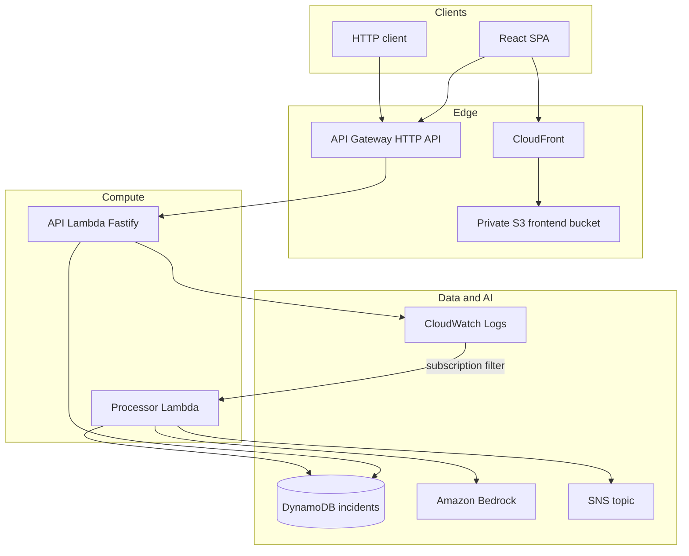

# IncidentLens AI — Architecture Overview

**Status:** Authoritative architecture overview for the deployed portfolio/demo stack.  
Focused subsystem docs live beside this file; prefer this document for end-to-end context.

## Request path (frontend + API)

```text
Browser (React SPA)
  → CloudFront (HTTPS)
      → private S3 (OAC)          # static assets
  → API Gateway HTTP API
      → Lambda (Fastify demo API)
          → DynamoDB (read/update incidents)
```

CORS allowlists the CloudFront origin (plus local Vite origins in the dev stack).
Production frontend builds bake `VITE_API_BASE_URL` to the API Gateway base URL.

## Incident detection path

```text
Application ERROR / 5XX (e.g. controlled GET /test-error)
  → API Lambda structured log (eventType = incident_candidate)
  → CloudWatch Logs
  → Subscription filter
  → Processor Lambda
```

## AI enrichment, persistence, notification

```text
Processor Lambda
  → validate / map candidate
  → DynamoDB saveIfAbsent (system of record first)
  → Amazon Bedrock (summary, possible cause, recommended actions)
  → DynamoDB analysis update (completed | failed)
  → SNS publish (high/critical only)
```

Reliability ordering: **persist → enrich → notify**. AI and SNS failures must not
roll back a persisted incident. Duplicate CloudWatch deliveries are idempotent
(no re-analyze / re-notify).

## Diagram



## CI/CD and IaC

- **Terraform:** `infrastructure/terraform/` — app stack (`environments/dev`) plus separate bootstrap (remote state + GitHub OIDC role).
- **GitHub Actions:** `.github/workflows/deploy-dev.yml` — PR validation without AWS mutation; `main` uses OIDC for plan/apply (gated), frontend S3 sync, CloudFront invalidation, and smoke verification.

## Observability

- Structured JSON logs (Pino) with `requestId` / `incidentId`
- CloudWatch log groups for API Lambda, processor Lambda, and API Gateway access logs (retention configured in Terraform)
- Manual CloudWatch Insights queries; metric alarms intentionally deferred (see production-readiness review)

## Related documents

| Topic                   | Document                                                                                           |
| ----------------------- | -------------------------------------------------------------------------------------------------- |
| AI pipeline details     | [ai-assisted-incident-pipeline.md](./ai-assisted-incident-pipeline.md)                             |
| Frontend hosting        | [frontend-aws-hosting.md](./frontend-aws-hosting.md)                                               |
| Bedrock / analysis      | [bedrock-integration.md](./bedrock-integration.md), [incident-analysis.md](./incident-analysis.md) |
| Notifications           | [incident-notifications.md](./incident-notifications.md)                                           |
| CloudWatch subscription | [cloudwatch-subscription.md](./cloudwatch-subscription.md)                                         |
| Production readiness    | [../reviews/production-readiness-review.md](../reviews/production-readiness-review.md)             |
| E2E verification        | [../verification/real-ai-incident-e2e.md](../verification/real-ai-incident-e2e.md)                 |
